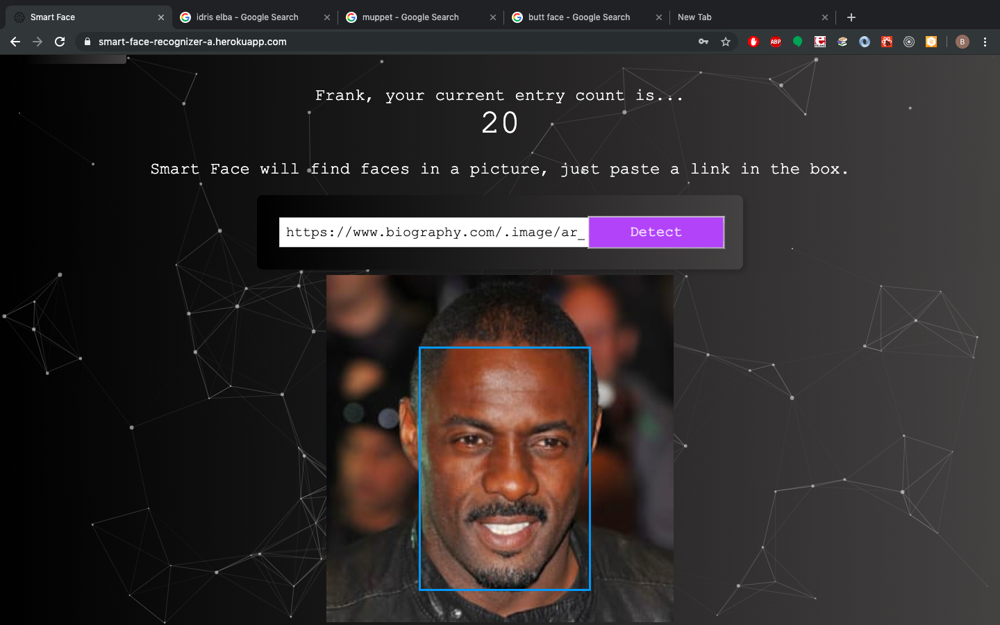
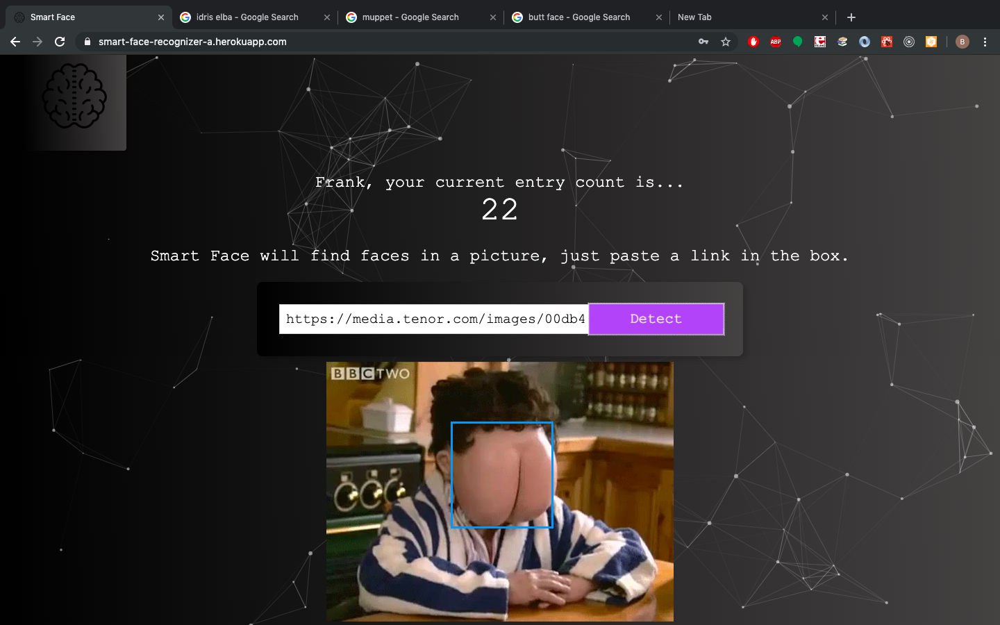

# Smart-Face-Front-End
> A small project that doesn't do that much!  (But what it does, it does pretty well.)

[Live Demo](https://smart-face-recognizer-a.herokuapp.com/)
>Heroku might need a minute to spin up a dyno so it will be slow at first :)

I made this app to showcase clean, simple react code,rock-solid authentication, API integration, a node/express server, and a small database.

Just sign in and paste a link to a photo in the box.  Smart Face will detect faces in it, and put a blue box around the face!  

## Screen Shots



# Interesting Edge Cases



## Installation

1. Fork and Clone down the repo
2. Visit [newsapi.org/](http://newsapi.org/) to get a Free API Key
3. Visit [meaningcloud.com/](http://www.meaningcloud.com/) to get a Free API Key
4. In the root directory of the project make a file called .env and define environmental variables
 ```
REACT_APP_NEWS_API_KEY = theapikeyuoutgot782734983242 
REACT_APP_MEANING_API_KEY = theotherpaikeyuoutgot782734983242
```
5. In a terminal, navigate to the root directory and run 

```
npm install 
```

6. Then run 

```
npm start 
```

## Meta

Ben Reilly –  benjamin.reilly@gmail.com

Distributed under the MIT license. See ``LICENSE`` for more information.

[https://github.com/Ibenthinkin/Nous-Front-End](https://github.com/ibenthinkin/)

## Contributing

1. Fork it (<https://github.com/Ibenthinkin/Nous-Front-End/fork>)
2. Create your feature branch (`git checkout -b feature/fooBar`)
3. Commit your changes (`git commit -am 'Add some fooBar'`)
4. Push to the branch (`git push origin feature/fooBar`)
5. Create a new Pull Request
