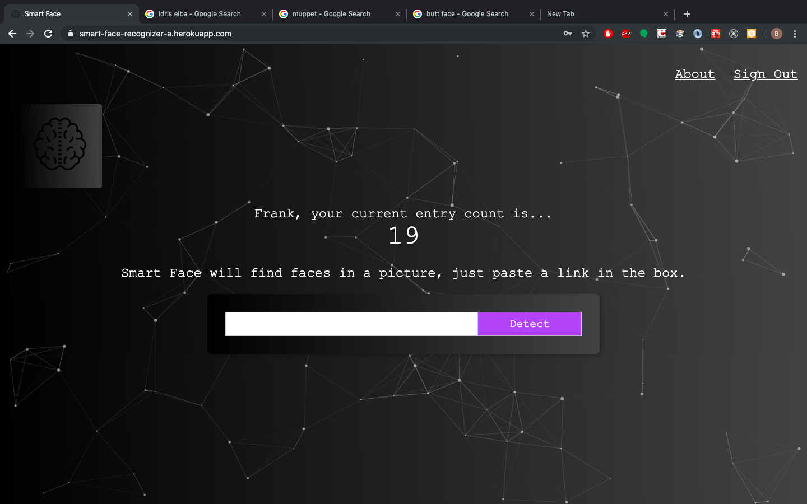

# Smart-Face-Front-End
> A small project that doesn't do that much!  (But what it does, it does pretty well.)

[Live Demo](https://smart-face-recognizer-a.herokuapp.com/)
>Heroku might need a minute to spin up a dyno so it will be slow at first :)

I made this app to showcase clean, simple react code,rock-solid authentication, API integration, a node/express server, and a small database.

Just sign in and paste a link to a photo in the box.  Smart Face will detect faces in it, and put a blue box around the face!  

## Screen Shots




# Interesting Edge Cases


## Installation

1. Fork and Clone down the repo
2. Fork and Clone the Back-end [Smart-Face-Backend](https://github.com/Ibenthinkin/Smart-Face-Back-End) 
3.Follow Install Instructions for the Back-End and Database.  They must both be running locally for the front end to work properly.
4.make a file called .env in the root directory of the front end project. In .env copy and paste the following code:

```  
   REACT_APP_BACKEND_URL = localhosthttp://localhost:3000/ 
```
4. In a terminal, navigate to the root directory and run 

```
npm install 
```

5. Then run 

```
npm start 
```

## Meta

Ben Reilly –  benjamin.reilly@gmail.com

Distributed under the MIT license. See ``LICENSE`` for more information.

[https://github.com/Ibenthinkin/Smart-Face-Front-End](https://github.com/ibenthinkin/)

## Contributing

1. Fork it (<https://github.com/Ibenthinkin/Nous-Front-End/fork>)
2. Create your feature branch (`git checkout -b feature/fooBar`)
3. Commit your changes (`git commit -am 'Add some fooBar'`)
4. Push to the branch (`git push origin feature/fooBar`)
5. Create a new Pull Request
